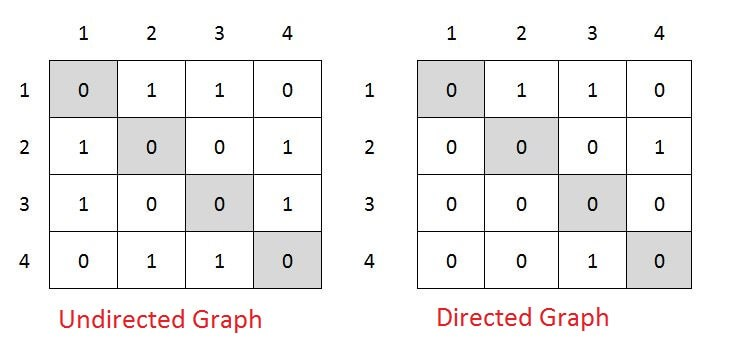
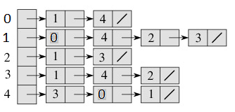

# Graphs
**Best Link:** https://www.geeksforgeeks.org/graph-data-structure-and-algorithms/

### At a Glance:
*A graph is a non-linear data structure consisting of two elements:*
- ***NODES** (or vertices) : A set of data points*
- ***EDGES** (or lines): The connections between nodes*

Each node is a structure and contains information like person id, name, gender, etc. The edges connecting nodes can represent a one-way relationship, called a directed edge, or a mutual, two-way relationship, called an undirected edge.

### Directed Vs Undirected
*While non-linear, graphs can exist as directed and undirected data structures:*

 *Think one-way flight vs round-trip.
- *Directed:   **Node(A) -----> Node(B)** (A) is connected to (B), however (B) is **NOT** connected to (A)*
- *Undirected: **Node(B) <----> Node(C)** : (B) is connected to (C) **AND** (C) is connected to (B)*

### How Graphs are Represented in Code
To represent a graph in code, we use adjacency list or an adjancency matrix.

### Graph Representations:
*Adjacency Matrix*
 

*Adjacency List*
 

### Why Graphs are Useful:
Graphs are eeeeverywhere because they represent a lot of real-world relationships.
For instance, graphs are frequently used to represent maps and networks. A map is a graph of locations (nodes) and the routes between them (edges). Think of a highway system or trails leading to different features in a state park. Networks show associations between a group of people or things, like a telephone network or a social network.

### Examples of Graph Implementation:
- Highway System
- The Six Degrees of Seperation
- Facebook Like & Comment
- Facebook Search for Friend (breadth vs depth)

### Useful Links Regarding Graphs
- General Backgound Info: https://en.wikipedia.org/wiki/Graph_(abstract_data_type)
- Data structures: Introduction to graphs : https://www.youtube.com/watch?v=gXgEDyodOJU
- Graph Interview Questions: https://stackabuse.com/graph-data-structure-interview-questions/
- https://visualgo.net/en/graphds?slide=1
- Pretty much single source of truth : https://www.geeksforgeeks.org/graph-data-structure-and-algorithms/

