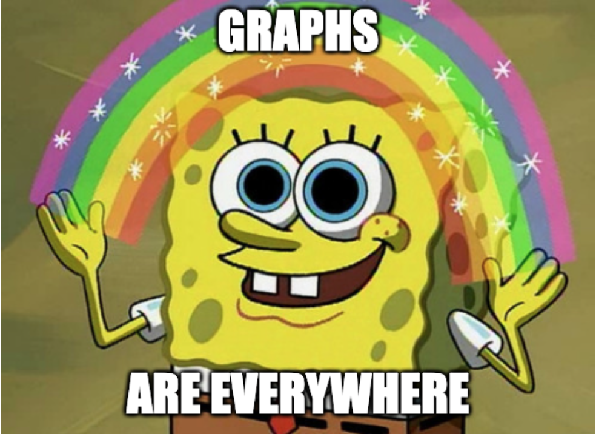
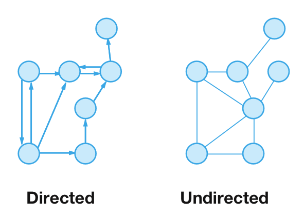

# Graphs

### At a Glance:
*A graph is a non-linear data structure consisting of two elements:*
- ***NODES** (or vertices) : A set of data points*
- ***EDGES** : The connections between nodes*

### Directed Vs Undirected
*While non-linear, graphs can exist as directed and undirected data structures where :*

 *Think one-way flight vs round-trip.
- *Directed:   **Node(A) -----> Node(B)** (A) is connected to (B), however (B) is **NOT** connected to (A)*
- *Undirected: **Node(B) <----> Node(C)** : (B) is connected to (C) **AND** (C) is connected to (B)*

### Why Graphs are Useful:
Graphs are eeeeverywhere because they represent a lot of real-world relationships.
For instance, graphs are frequently used to represent maps and networks. A map is a graph of locations (nodes) and the routes between them (edges). Think of a highway system or trails leading to different features in a state park. Networks show associations between a group of people or things.

### Examples of Graph Implementation:
Highway System
The Six Degrees of Association
Facebook Like & Comment
Facebook Search for Friend (breadth vs depth)

### Useful Links Regarding Graphs
- General Backgound Info: https://en.wikipedia.org/wiki/Graph_(abstract_data_type)
- Data structures: Introduction to graphs : https://www.youtube.com/watch?v=gXgEDyodOJU
- Graph Interview Questions: https://stackabuse.com/graph-data-structure-interview-questions/
- https://visualgo.net/en/graphds?slide=1

A short CS presentation on Graphs

## Deliverables
  - A repository on Github with a `README.md`
  - One paragraph explaining the concept behind the topic assigned to your group. Include this in your `README.md`.
  - At least two examples of the assigned topic.
  - One paragraph outlining different types of questions that can be asked/solved using the given topic. 
  - A link to all relevant resources. This can include the software's site, a helpful tutorial site, a medium article, etc.
  
  Submit a link to your repository (including the README.md with paragraphs and links) to the slack channel.

